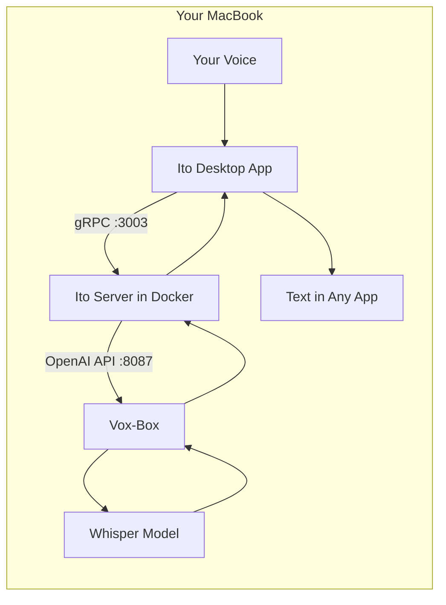

# Running Ito Locally on macOS (Fully Offline)

This guide walks you through setting up the Ito transcription service to run entirely on your MacBook without requiring any cloud API keys or internet connection for transcription.

## Overview

In the standard setup, Ito uses cloud-based ASR providers (Groq, Aliyun) for speech-to-text. This guide shows how to replace those with a local Whisper model using [Vox-Box](https://github.com/gpustack/vox-box), which provides an OpenAI-compatible API for local transcription.

### Architecture



**How it works:**
1. The Ito desktop app captures your voice and sends audio to the Ito server via gRPC
2. The server is configured to use the "openai" ASR provider with a custom base URL
3. That URL points to Vox-Box running locally, which hosts a Whisper model
4. Transcription happens entirely on your machine

## Prerequisites

Before starting, ensure you have:

- **macOS 12.0+** (Monterey or later)
- **Python 3.10+** with pip
- **Docker Desktop** installed and running
- **Bun** package manager (for running the Ito app)
- **At least 4GB free RAM** for the Whisper model

Verify your setup:

```bash
python3 --version   # Should be 3.10+
docker --version    # Should show Docker version
bun --version       # Should show Bun version
```

## Step 1: Install Vox-Box

Vox-Box is a tool that serves speech models (like Whisper) via an OpenAI-compatible API.

```bash
pip install vox-box
```

## Step 2: Start Vox-Box with a Whisper Model

Start Vox-Box serving a local Whisper model. The model will be downloaded automatically on first run:

```bash
vox-box start \
  --huggingface-repo-id Systran/faster-whisper-small \
  --port 8087 \
  --data-dir ~/.cache
```

**Model options** (choose based on your hardware):

| Model | Size | Speed | Accuracy | Command |
|-------|------|-------|----------|---------|
| Tiny | ~75MB | Fastest | Lower | `Systran/faster-whisper-tiny` |
| Base | ~150MB | Fast | Medium | `Systran/faster-whisper-base` |
| Small | ~500MB | Medium | Good | `Systran/faster-whisper-small` |
| Medium | ~1.5GB | Slower | Better | `Systran/faster-whisper-medium` |
| Large | ~3GB | Slowest | Best | `Systran/faster-whisper-large-v3` |

Keep this terminal window open. Vox-Box needs to stay running.

### Verify Vox-Box is Running

In a new terminal, test the API:

```bash
curl http://localhost:8087/v1/models
```

You should see a JSON response listing the available model.

## Step 3: Configure the Ito Server

Navigate to the server directory and set up the environment:

```bash
cd server
cp .env.example .env
```

Edit `server/.env` and set these values:

```bash
# Point to local Vox-Box instead of cloud providers
ASR_PROVIDER="openai"
OPENAI_API_KEY="local-dev-key"
OPENAI_BASE_URL="http://host.docker.internal:8087/v1"
OPENAI_DEFAULT_ASR_MODEL="whisper-small"

# Optional: If you want LLM features to work, you'll still need a cloud API key
# GROQ_API_KEY="your-key-here"
```

**Important notes:**
- `host.docker.internal` is how Docker containers access the host machine's localhost
- `OPENAI_API_KEY` can be any non-empty string (Vox-Box doesn't validate it)
- The model name should match what you're running in Vox-Box

## Step 4: Start the Ito Server

Start the server using Docker Compose:

```bash
cd server
docker compose up -d
```

This starts:
- PostgreSQL database on port 5432
- Ito gRPC server on port 3003

### Verify the Server

Check that the server is running:

```bash
curl http://localhost:3003/
```

You should see a response indicating the server is up.

Check the logs if needed:

```bash
docker compose logs -f ito-grpc-server
```

## Step 5: Configure the Ito Desktop App

In the project root, set up the client environment:

```bash
# From the project root (not server/)
cp .env.example .env
```

Edit the root `.env` file and ensure it has:

```bash
VITE_GRPC_BASE_URL="http://localhost:3003"
```

## Step 6: Run the Ito App

Install dependencies and start the development build:

```bash
# From project root
bun install
./build-binaries.sh  # Build native components (first time only)
bun run dev
```

The app should launch and connect to your local server.


## Optional: CosyVoice TTS Support

If you want text-to-speech capabilities with CosyVoice (not needed for transcription), you'll need additional dependencies:
```bash
brew install openfst
export CPLUS_INCLUDE_PATH=$(brew --prefix openfst)/include
export LIBRARY_PATH=$(brew --prefix openfst)/lib
pip install pynini==2.1.7

git clone https://github.com/wenet-e2e/WeTextProcessing.git

cd WeTextProcessing
sed -i '' 's/pynini==2\.1\.6/pynini==2.1.7/g' requirements.txt
pip install -r requirements.txt

cat > setup.py <<'PY'
import os
import re
import sys
from setuptools import find_packages, setup

def extract_version(argv):
    # Accept optional "version=..." argument (used by their release workflow),
    # but don't crash when pip/setuptools calls setup.py without it.
    for a in list(argv):
        m = re.fullmatch(r"version=(.+)", a)
        if m:
            argv.remove(a)
            return m.group(1)
    # Fallback: env var or a reasonable default
    return os.environ.get("WETEXTPROCESSING_VERSION", "1.0.4.1")

version = extract_version(sys.argv)

with open("README.md", "r", encoding="utf8") as fh:
    long_description = fh.read()

setup(
    name="WeTextProcessing",
    version=version,
    author="Zhendong Peng, Xingchen Song",
    author_email="pzd17@tsinghua.org.cn, sxc19@tsinghua.org.cn",
    long_description=long_description,
    long_description_content_type="text/markdown",
    description="WeTextProcessing, including TN & ITN",
    url="https://github.com/wenet-e2e/WeTextProcessing",
    packages=find_packages(),
    package_data={
        "tn": ["*.fst", "chinese/data/*/*.tsv", "english/data/*/*.tsv", "english/data/*.tsv", "english/data/*/*.far"],
        "itn": ["*.fst", "chinese/data/*/*.tsv"],
    },
    # IMPORTANT: avoid forcing pynini==2.1.6 (which can fail to build on macOS for you)
    install_requires=["pynini>=2.1.7", "importlib_resources"],
    entry_points={"console_scripts": ["wetn = tn.main:main", "weitn = itn.main:main"]},
    tests_require=["pytest"],
    classifiers=[
        "Programming Language :: Python :: 3",
        "Operating System :: OS Independent",
        "Topic :: Scientific/Engineering :: Artificial Intelligence",
    ],
)
PY

pip install -e . --no-deps
```